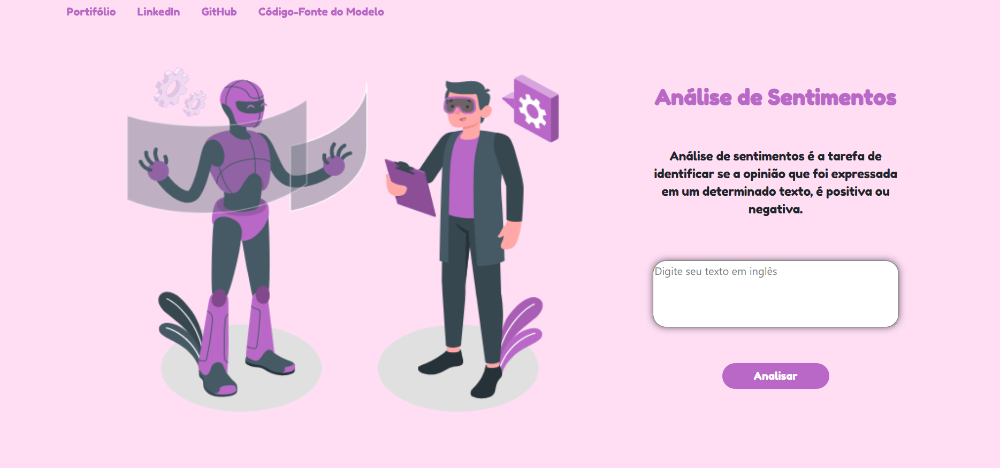
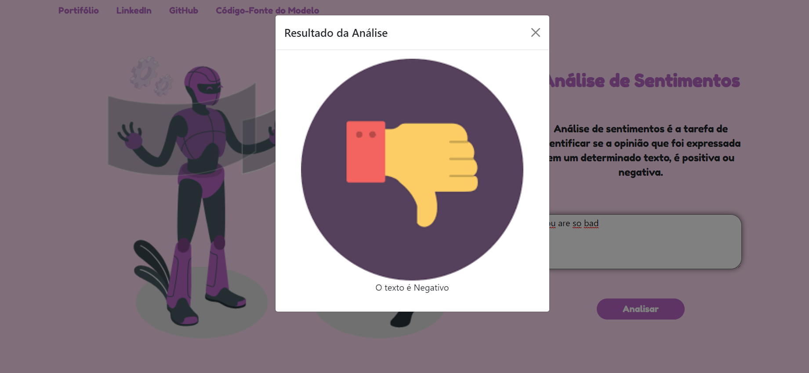
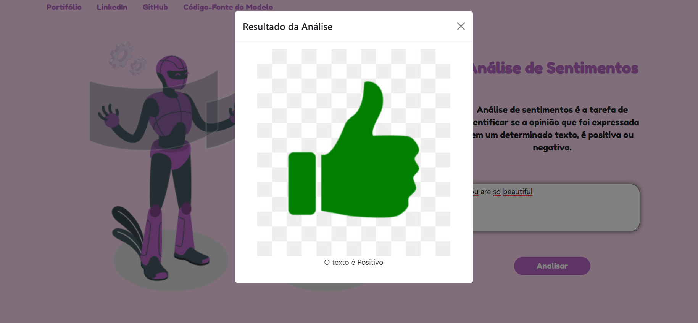

# Processamento-Linguagem-Natual-Estudo

app.py - Arquivo contendo o código da aplicação com rotas criadas através do Flask  
utils.py - Arquivo contendo o código de algumas funções utilizadas no app para importar o modelo criado (mymodel) e pré-processar os dados de entrada

## Objetivo
Este projeto tem por objetivo a criação de uma aplicação de Análise de Sentimentos.

## Passo a Passo
## 1) Pipeline de NLP
Inicialmente foi feito todo o pipeline de processamento de linguagem natural com processo com:
### 
 - Aquisição
 - Importação
 - pré-processamento
 - Remoção de Stopwords
 - Etapa de Lemming/Stemming
 - Tokenização
 - Divisão dos dados em treino/teste
 - Criação de uma Rede Neural
 - Treinamento da Rede Neural
 - Exportação

## 2) Criação do APP com Flask
Após isso, foi feito a criação do app utilizando Flask, importando o modelo, criando as rotas e renderizando um template HTML (também criado por mim) que receberá as informações do formulário e estas a partir de uma função de pré-processamento transformadas em dados no mesmo formato de entrada que a Rede Neural foi treinada.

## 3) Criação da Interface
Foi criado uma interface extremamente simples para teste do modelo, utilizando puro HTML e CSS.  
Ela foi formada apenas com um gif e um formulário para receber os dados. Possui um header simples com links para o github, linkedin, código fonte e o portifólio que estou criando.  
Pretendo ainda refinar a interface, assim como o modelo em oportunidades futuras, mas isso explicarei em desafios futuros.

## 4) Prints de Tela da Interface

### Tela Inicial
Há uma breve explicação e o espaço para digitar o texto em INGLÊS.

 

### Caso Negativo
Foi digitado o texto "you are so bad" no qual foi classificado como negativo.  
Neste caso, é aberto um modal simples com uma imagem de negação e o texto informando a classificação negativa.

 

### Caso Positivo
Foi digitado o texto "you are so beautiful" no qual foi classificado como positivo.  
Neste caso, é aberto um modal simples com uma imagem de negação e o texto informando a classificação positiva.

 

## 5) Desafios Futuros
Uma das ambições futuras é o refinamento da interface e também da rede neural utilizada. Aumentar a acurácia da mesma e o aumento de verdadeiros positivos "tunando" os parâmetros a fim de encontrar a melhor combinação.  
Outra ambição é fazer o treinamento de outro modelo para aplicar também ao português.

## Obrigado!!
